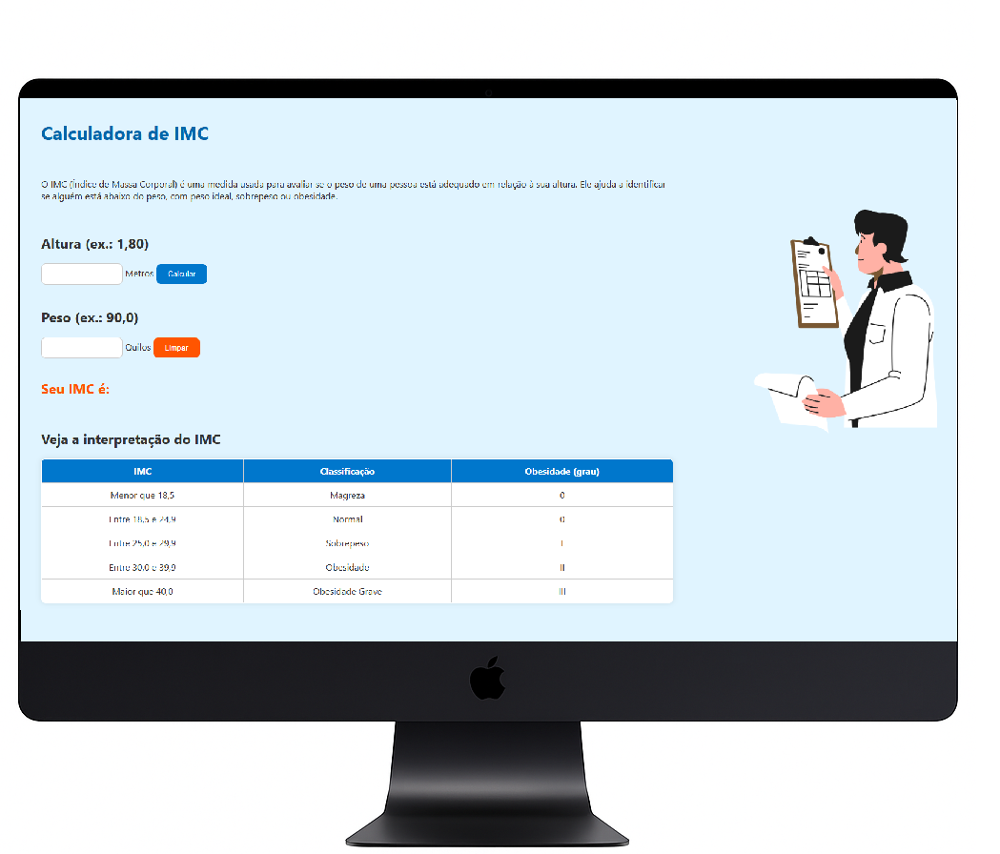
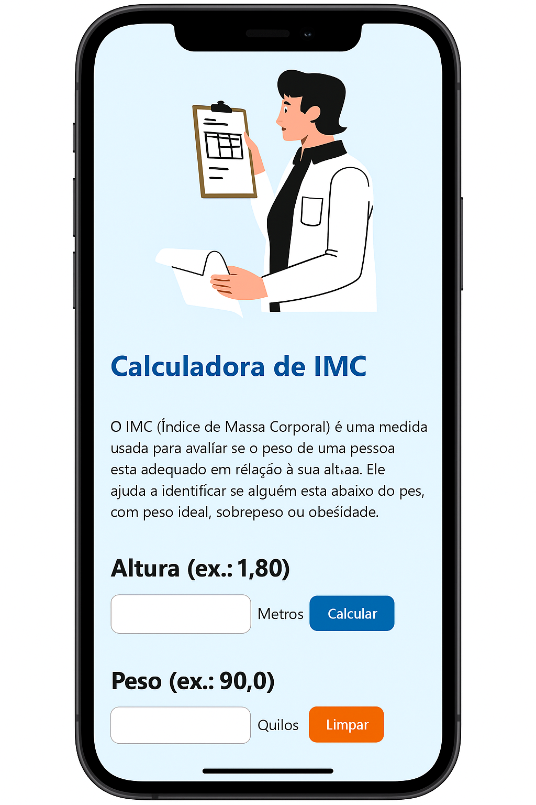
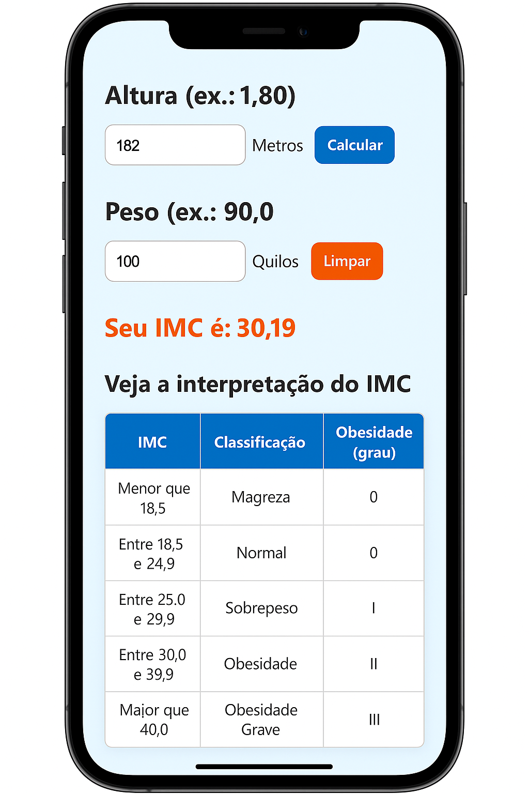

# 🧮 Calculadora de IMC

Este é um projeto simples de **Calculadora de IMC (Índice de Massa Corporal)**, desenvolvido com **HTML**, **CSS** e **JavaScript**. A aplicação permite que o usuário insira seu peso e altura para calcular o IMC e ver a classificação correspondente: magreza, normal, sobrepeso ou obesidade.

---

## 🚀 Funcionalidades

- ✅ Cálculo automático do IMC
- ✅ Botão para limpar os campos e o resultado
- ✅ Interface visual clara e objetiva
- ✅ Layout responsivo para celulares
- ✅ Tabela com a interpretação dos valores do IMC

---

## 🛠️ Tecnologias usadas

- HTML5  
- CSS3  
- JavaScript   

---

## 📷 Demonstração

### 💻 Versão para Desktop

  

### 📱 Versão Responsiva (Mobile)

  
  

---

## 🧠 O que é o IMC?

O **IMC (Índice de Massa Corporal)** é uma medida usada para avaliar se o peso de uma pessoa está adequado em relação à sua altura. Ele ajuda a identificar condições como **magreza, peso ideal, sobrepeso e obesidade**.

